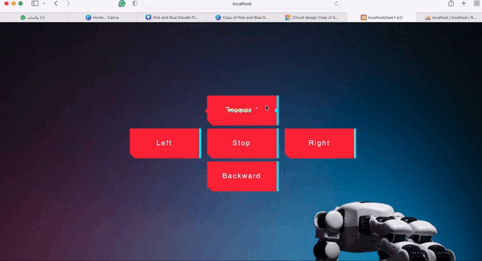

# sm-webdev-task1-buttons

## Description
Task 1: Develop a web page with five buttons (forward, backward, right, left, stop). Each button, when clicked, sends its name to a MySQL database.

## Project Structure
- `index.html`: The web page with five buttons.
- `style.css`: The stylesheet for styling the buttons.
- `script.js`: The JavaScript file for handling button clicks.
- `database.php`: The PHP script for connecting to the MySQL database and inserting button click data.

## Installation

### Installing XAMPP
1. Download XAMPP from the [official website](https://www.apachefriends.org/index.html).
2. Follow the installation instructions for your operating system.
3. Start the Apache and MySQL modules from the XAMPP control panel.

### Setting Up the Project
1. Create a new folder on your Desktop for the project.
2. Open Visual Studio Code (or your preferred code editor) and create the following files in your project folder:
    - `index.html`
    - `style.css`
    - `script.js`
    - `save_button_click.php`
3. After creating and saving your files, move the entire project folder to the `htdocs` directory in your XAMPP installation (usually located at `C:\xampp\htdocs` on Windows or `/Applications/XAMPP/htdocs` on macOS).
4. Open phpMyAdmin (`http://localhost/phpmyadmin`) and create a new database named `Robot`.
5. Inside the `Robot` database, create a table named `ButtonClicked` with two columns:
   - `id` (INT, auto_increment, primary key)
   - `buttonname` (VARCHAR(50))
6. Set up your MySQL database connection in `save_button_click.php` with your database credentials.

## Usage
1. Open your web browser and navigate to `localhost/your_folder_name`.
2. Click on the buttons to send their names to the MySQL database.

## Web Page Preview

